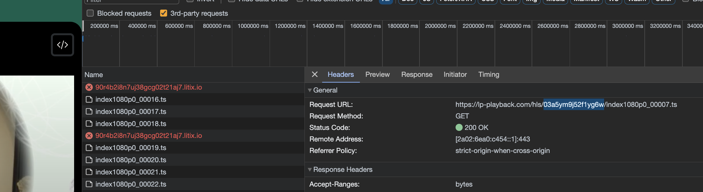

# Streameth/m3u8 Downloader

This script downloads a bunch of m3u8 video/stream parts. It does it by making a folder for each id, grabbing each of the .ts files, then stringing them back together with ffmpeg.

## Dependencies

You need ffmpeg installed, and requests installed on pip.
```
brew install ffmpeg
pip install -r requirements.txt
```

## Usage
```
python3 downloader.py <video id> <optional: resolution. default: '1080p'>
```

The video ID is this value from the URL in the 'Network' tab for each part:


Optionally, you can specify the resolution (i.e. '360p') as the second argument. The default is '1080p'.

You can optionally delete individual files at the end via:
```
rm -rf <video id>/index*
```